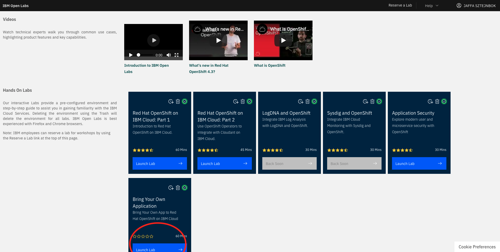
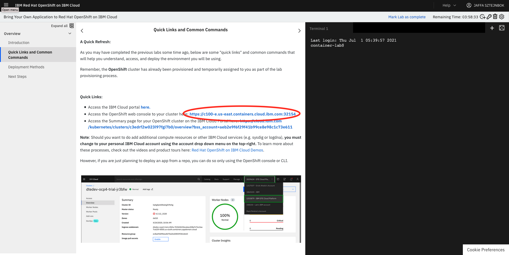
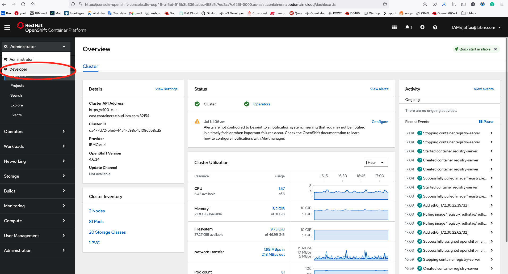
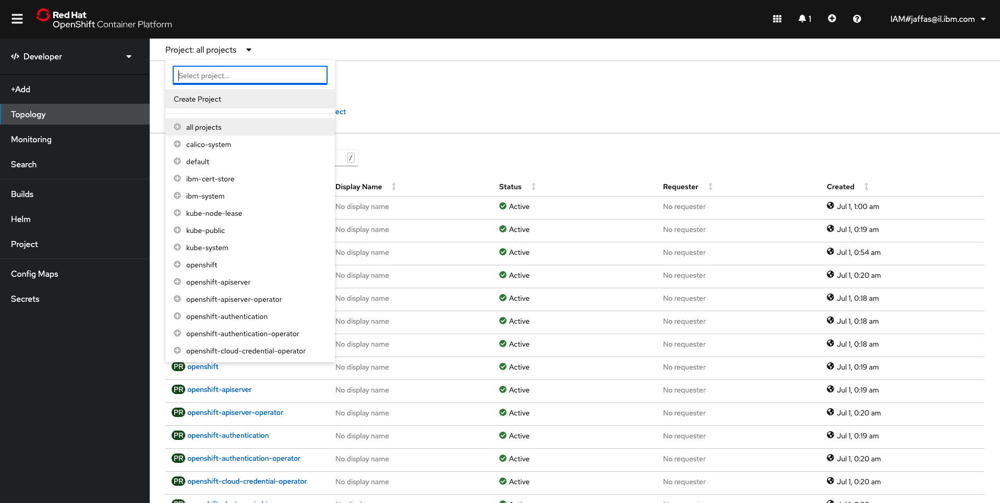
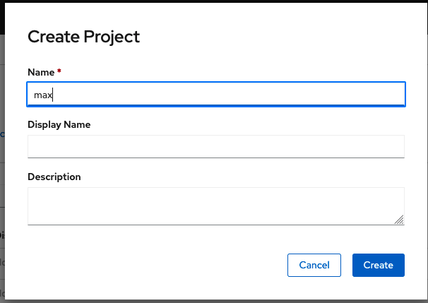
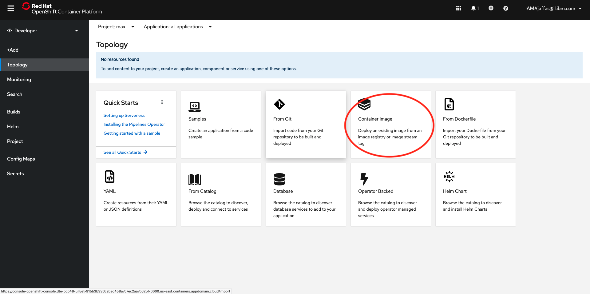

# Register to IBM Cloud 

[Register IBM Cloud](https://ibm.biz/Bdfv92 )

Please make sure to run all steps to get a valid IBM Lite Cloud account 

# Get a preconfigured OpenShift environment available for four hours at no charge
1. [access to IBM Openshift  Cluster]( https://developer.ibm.com/openlabs/openshift)

2. Click on Bring Your Own Application    

A cluster will be allocated for you , this might take a few secounds.... 
<!-- ( optional not part of the workshop  : you may run Lab 1 ,2 ,3 to learn about Openshift ) -->
# Access the OpenShift web console to your cluster 

# Choose to work with Developer View

# Go to Create Project

# Create Project by the name of 'max-deployments'

# Choose from Docker image

 
# The LAB 
From this point on run Lab1 (from step 1 no need to run the pre-requistes ) , Lab2 , Lab3 from (https://ibm.github.io/kube101/Lab1/)
 

